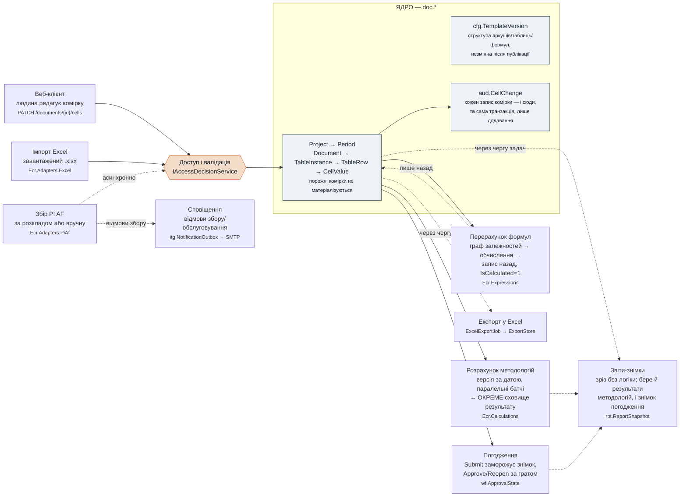

# B23 — Схема потоків даних (візуальний огляд)

**Призначення:** одна сторінка, яка відповідає на питання «як дані входять у
ECR Web, що застосунок з ними робить і куди вони виходять» — для людини, яка
вперше бачить репозиторій і не хоче збирати цю картину з прози B01–B22.

**Джерело:** фактичний код репозиторію (`src/`) станом на дату нижче, не
проєктна документація. Де код і B01–B22 розійшлися — вірний код; якщо
розбіжність суттєва, варто завести запис у `docs/build/questions.md`.

**Дата побудови:** 2026-09-11.

---

## 1. Наскрізний потік

Три незалежні шляхи введення сходяться в одному сховищі документа. Звідти
дані розходяться двома розрахунковими механізмами, погодженням і трьома
шляхами виходу.

**Прочитання:** суцільна стрілка — синхронний виклик у межах запиту;
пунктирна — асинхронно, через чергу фонових задач (Quartz). Ворота доступу
й валідації (`IAccessDecisionService`) — єдина точка рішення для всіх трьох
джерел вводу; жоден контролер не перевіряє права сам. Перерахунок формул
пише результат назад у те саме ядрове сховище; розрахунок методологій і
погодження пишуть в окремі, незалежні сховища — жодне з них не копіюється
назад у `doc.CellValue`.

---

## 2. Три конкретні шляхи введення

| # | Шлях | Точка входу | Обробник | Що відбувається |
|---|------|--------------|----------|------------------|
| a | Правка у вебі | `PATCH /api/v1/documents/{id}/cells` | `PatchCellsHandler` | Перевірка `BaseVersion` рядка (конфлікт → `409 ECR-CELL-0409`), право через `IAccessDecisionService`, валідація (`ValidationEngine`), один транзакційний запис (`ICellStore.ApplyAsync` + `TouchRowsAsync` + `IAuditWriter`), після коміту — постановка перерахунку |
| b | Імпорт Excel | завантажений `.xlsx` | `PreviewImportHandler` → `ApplyImportHandler` | `IExcelImporter.PreviewAsync` будує diff/токен попереднього перегляду; застосування — синхронно (≤2000 змінених комірок) або через `ExcelImportJob`, тим самим шляхом запису комірок, що й (a) |
| c | Збір PI AF | розклад Quartz або `POST /sources/{id}/entities/{eid}/collect` | `CollectionJob` → `ICollectionRunner` | Транспорт за `ext.DataSource.TransportKind` (`PiWebApiDataSource`/`PiSqlClientDataSource`), сирі точки — в `ext.RawDataPoint` ідемпотентно; окремо `MaterializeCollectedDataJob` мапить їх у `doc.CellValue` за `ext.EntityFieldMap` |

---

## 3. Два розрахункові механізми — навмисно різні

Це не один рушій із двома режимами, а два різні механізми з різним
призначенням і різним сховищем результату:

| | Перерахунок формул | Розрахунок методологій |
|---|---|---|
| **Модуль** | `Ecr.Expressions` | `Ecr.Calculations` |
| **Що рахує** | формули шаблону (`cfg.FormulaDef`) | методології звітності (версійні, за датою періоду) |
| **Вхід зміни** | `PatchCellsHandler` сіє змінені адреси → `RecalculationService` | `CalculationOrchestrator.RunAsync`, батчами, паралельно (`MaxParallelism=4`) |
| **Куди пише** | назад у `doc.CellValue`, `IsCalculated=1` | `calc.CalculationResult` — **окреме** сховище |
| **Копіюється в `doc.CellValue`?** | — (це і є `doc.CellValue`) | **ні, ніколи** |

---

## 4. Три шляхи виходу — і один постійний тап

- **Excel-експорт** — `ExportDocumentHandler` ставить `ExcelExportJob`,
  результат лежить в `IExportStore`, клієнт спершу опитує статус задачі.
- **Звіти-знімки** — `ReportSnapshotJob` матеріалізує `rpt.ReportSnapshot`;
  бере і `doc.CellValue`, і `calc.CalculationResult`, і заморожений знімок
  погодження — це справжній merge трьох джерел, не проста вибірка з одного.
- **Сповіщення** — `NotificationJob` збирає відмови збору/обслуговування в
  `itg.NotificationOutbox`, `SmtpNotificationSender` розсилає.
- **Аудит (не «вихід», а постійний тап)** — кожен запис комірки в тій самій
  транзакції йде і в `aud.CellChange` (лише `INSERT`, дані читаються, не
  видаляються).

---

## 5. Наскрізні механізми

Три речі торкаються практично кожного потоку вище, тому не намальовані як
окремі вузли на схемі §1 — інакше головна лінія загубилася б у деталях.

- **Доступ.** Один сервіс, `Ecr.Application.Security.IAccessDecisionService`
  (`BuildProfileAsync`, `CanEditSliceAsync`, `CanCreateRowsAsync`,
  `CanSubmitAsync`, …). Немає жодного контролера, що перевіряє роль сам —
  архітектурне правило 7 (`docs/tz/03-architecture.md` §3.3).
- **Фонові задачі.** `IBackgroundJobScheduler` абстрагує Quartz;
  `QuartzJobAdapter` — генеричний міст Quartz→`IBackgroundJob`, через який
  проходять усі задачі, кожна у своєму DI-scope. Recurring-задачі (нічні
  перевірки, погодинний перерахунок) координуються між інстансами застосунку
  через `SqlDistributedLock` (`sp_getapplock`, не блокуюча спроба) — без
  нього кожен інстанс виконав би той самий тик окремо.
- **Кеш.** `MetadataCache` кешує незмінний знімок структури шаблону за
  ключем `v{id}:r{presentationRevision}` — інвалідація не потрібна взагалі,
  бо опублікована структура незмінна за визначенням (§3 у B00-INDEX).

---

## 6. Дев'ять збірок (`src/`)

| Модуль | Роль у потоці | Не залежить від |
|---|---|---|
| `Ecr.Domain` | Сутності й інваріанти — `Project`, `Document`, `TableRow`, `CellValue`. Жодного EF Core, жодних адаптерів | усього іншого |
| `Ecr.Expressions` | Одна граматика виразів на все: формули, правила валідації, фільтри рядків | `Domain`, `Infrastructure` |
| `Ecr.Application` | Сценарії використання як прості класи-обробники (без MediatR) + порти (інтерфейси) до інфраструктури | `Infrastructure`, `Api` |
| `Ecr.Infrastructure` | EF Core, фонові задачі (Quartz), кеш — реалізує порти `Application` | `Api` |
| `Ecr.Calculations` | Рушій розрахунку методологій — окремий від формул шаблону | `Api`, `Web` |
| `Ecr.Adapters.Excel` | Двосторонній імпорт/експорт `.xlsx` (ClosedXML) з мапінгом координат | `Api`, `Web` |
| `Ecr.Adapters.PiAf` | Два транспорти збору з PI AF: Web API і SQL Client (RTQP) | `Api`, `Web` |
| `Ecr.Api` | Хост ASP.NET Core: контролери, автентифікація, OpenAPI | `Web` |
| `Ecr.Web` | React SPA — говорить із `Api` лише через типізований клієнт (OpenAPI) | — |

---

## 7. Пов'язані документи

Ця сторінка — візуальний вхід; деталі кожного механізму вже описані окремо
і тут не дублюються:

- Шлях запису й транзакційні межі — [B04](B04-write-path.md)
- Мова виразів і граф перерахунку — [B03](B03-expressions.md)
- Безпека в runtime — [B05](B05-security-runtime.md)
- Порти інтеграції (PI AF) — [B06](B06-integration-ports.md)
- Фонові задачі й спостережуваність — [B07](B07-jobs-and-observability.md)
- Розрахунковий рушій методологій — [B13](B13-ecr-calculation-engine.md)
- Оркестрація перерахунку — [B15](B15-ecr-recalc-orchestration.md)
- Звітність — [B16](B16-ecr-reporting.md)
- Фізична модель `doc.*` — `docs/build/02a-db-schema.md`
