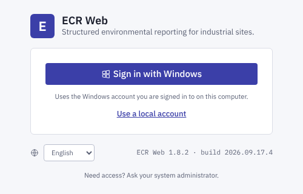
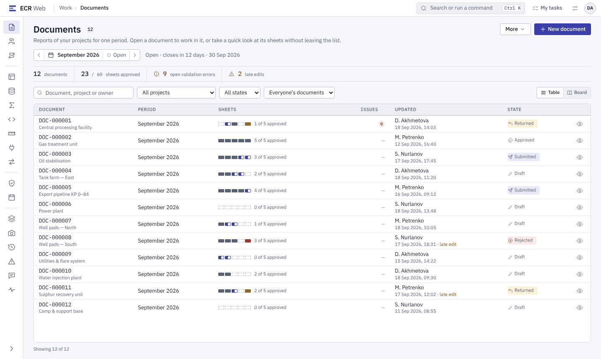
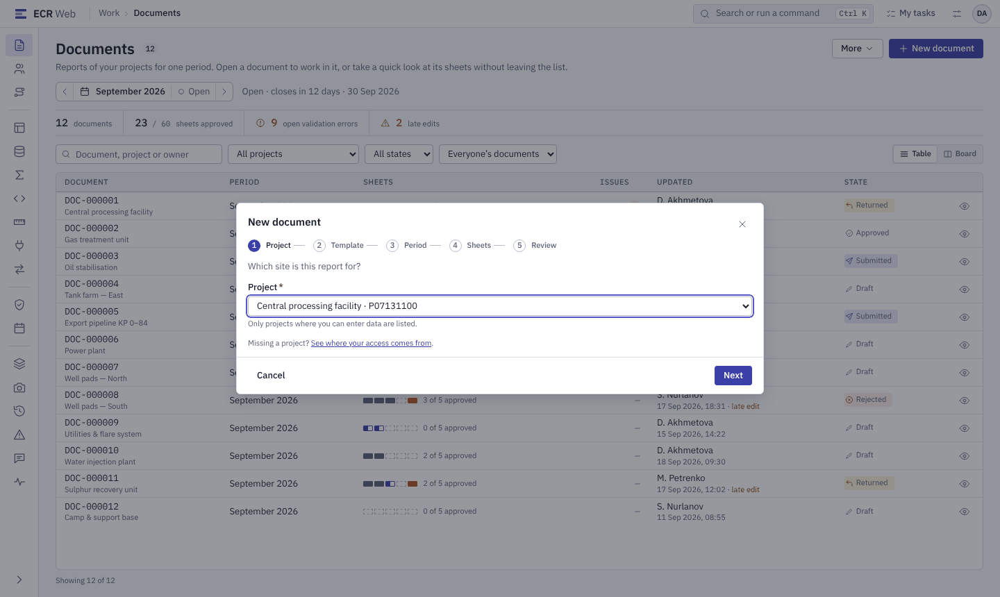
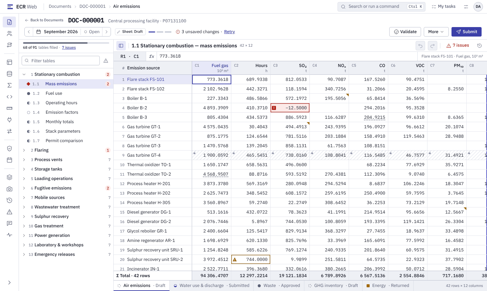
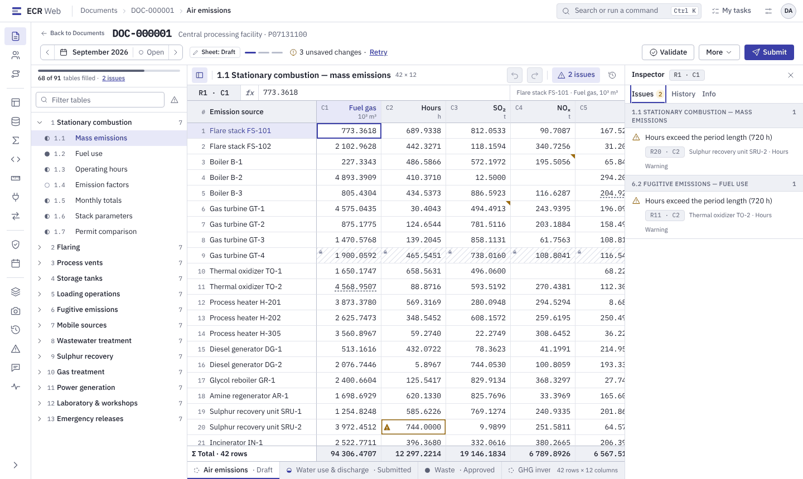
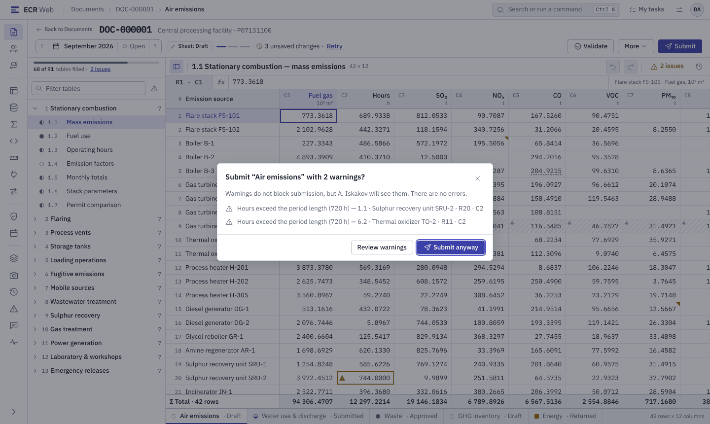
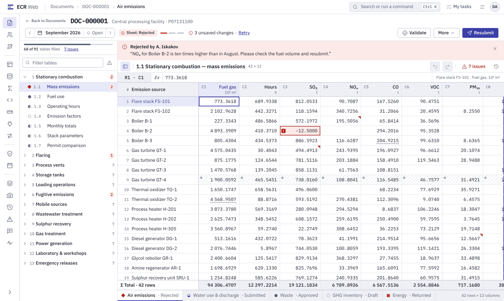

# Виконавець (`DataEntry`): від входу до подання

Для того, хто заповнює звітні документи. Потрібні роль `DataEntry` і доступ до
проєкту рівня не нижче `Write` (⚠ залежить від налаштувань). Подробиці кожного
кроку — [`../role-guide.md`](../role-guide.md), розділ 1.

**Що вміє роль `DataEntry`** (сід, `docs/admin/admin-guide.md` §1.1):
переглядати, створювати документи, імпортувати й експортувати Excel, подавати
аркуші; переглядати шаблони, довідники й методики. Затверджувати й
повертати аркуші вона **не** може, регуляторних зрізів не бачить.

## 1. Увійти

*Макет: `#/login`. У застосунку заголовок — «Environmental Compliance
Reporting», поля входу локальним записом показані одразу під кнопкою Windows.*

1. Відкрийте адресу ECR, яку дав адміністратор.
2. Доменний запис: **«Sign in with Windows»**. Локальний запис: **«User name»**,
   **«Password»**, **«Sign in»**.
3. Перший вхід з паролем від адміністратора — система одразу попросить
   новий пароль (**«Change password»**): щонайменше 12 символів, без імені
   входу, не з переліку поширених.
4. Після 5 невдалих спроб локальний запис блокується на 15 хвилин (дефолти
   політики, ⚠ залежить від налаштувань).

## 2. Знайти документ

*Макет: `#/`. У застосунку є вибір періоду, фільтр **«State»**, кнопка
**«New document»** і колонка стану кожного аркуша. Пошук за назвою, фільтр
проєкту, перемикач Table/Board, смуга лічильників і «око» швидкого перегляду —
**(у плані)**.*

1. **«Documents»** у лівому меню.
2. Перевірте **«Period»** угорі. Без явного вибору список відкривається з
   найновішим відкритим періодом.
3. Відкрийте документ кліком по рядку.

Список порожній — у вас немає доступу до жодного проєкту. Відкрийте
**«My groups»** і зверніться до адміністратора.

## 3. Створити документ (якщо його ще немає)

*Макет: `#/?dialog=create-document`. У застосунку це **одна форма**, а не
п'ять кроків: проєкт, версія шаблону, період, аркуші, назва. Покроковий
майстер — **(у плані)**.*

1. **«New document»**.
2. Оберіть проєкт, **«Template version»**, період, **«Sheets»**; назва
   (**«Document name»**) необов'язкова. Номер документа призначає система.
3. Сервер перевіряє правила складу аркушів. Відмова «The selected sheets
   break the sheet group rules.» — змініть вибір аркушів.

## 4. Заповнити таблиці

*Макет: `#/documents/DOC-000001?as=DataEntry&sheetState=Draft`. У
застосунку аркуші перемикаються вкладками над таблицею. Дерево таблиць зліва
й бічна панель «Inspector» — **(у плані)**.*

- Вводьте значення прямо в комірку. Збереження **автоматичне**: біля таблиці
  «Saving...» → «Saved».
- Вставка блоку з Excel — Ctrl+V. Зайві знаки після коми при вставці
  округлюються до точності колонки, ручне введення зайвих знаків —
  відхиляється.
- Десятковий роздільник — кома або крапка, без розділювачів тисяч.
- Сірі (обчислені) комірки не редагуються: значення рахує формула.
- Стрілка після набору зберігає значення й переходить до сусідньої комірки,
  як в Excel. Enter, F2 або клік відкривають редактор тексту в комірці.
- Немає аркушів — «This document has no sheets for the selected period.»:
  найчастіше період ще не відкрито.

Excel замість ручного вводу: **«Export»** → правка значень у книзі →
**«Import from Excel»** → панель **«Review the import»** (що зміниться,
конфлікти, відмови) → **«Apply»**. Імпорт не створює рядків і не міняє
обчислених комірок. Скасування імпорту однією кнопкою немає — перевіряйте
перелік змін до **«Apply»** (`role-guide.md`, розділ 5).

## 5. Перевірити

*Макет: панель зауважень справа. У застосунку результат показує панель
**«Validation findings»** з колонками рівня, рядка, колонки, правила й
«What is wrong».*

1. **«Validate»**.
2. Для кожного зауваження — **«Show in the table»**: застосунок переведе на
   потрібну комірку.
3. **Error** блокує подання, **Warning** — ні. Без зауважень — «Validation
   passed with no errors.»
4. Якщо в документі є методики (розрахунки викидів) і ви змінили вхідні дані,
   натисніть **«Recalculate»** перед поданням.

## 6. Подати

*Макет: `?issues=warnings&dialog=submit-with-warnings`. У застосунку
діалог **«Submit with warnings?»** з переліком і кнопкою **«Submit anyway»**.*

1. **«Submit»** (аркуш у стані **Draft** або **Rejected**).
2. Є лише попередження — **«Submit anyway»**; ваше підтвердження пишеться в
   журнал аудиту. Помилки рівня Error так не обійти.
3. Успіх — «The sheet has been submitted.» Аркуш стає **Submitted** і
   закритий для правок.

Подання проходить, якщо у вас рівень `Submit` або `Write` разом із правом
`Document.Submit` (воно є в `DataEntry`). Відмова «Your access level is too
low to submit this sheet…» — питання до адміністратора.

**Передумали?** **«Recall»** повертає поданий аркуш у **Draft**, доки
погоджувач нічого не підписав. Причина обов'язкова; відкликати може лише той,
хто подав.

## 7. Аркуш повернули

*Макет: `?as=DataEntry&sheetState=Rejected`. У застосунку причину видно в
панелі **«History»**, а повторне подання — та сама кнопка **«Submit»**
(у макеті «Resubmit»).*

1. Стан аркуша **Rejected** (відхилено) або **Draft** (повернуто
   затверджений) — відкрийте **«History»** і прочитайте причину.
2. Виправте дані, **«Validate»**, **«Submit»**. Попереднє подання лишається в
   історії; погоджувач зможе порівняти версії.

## Якщо щось пішло не так

| Бачите | Що робити |
|---|---|
| «Period … is closed…» або «… is not open yet…» | період закритий або ще не відкритий — до адміністратора періодів |
| «Some cells were not saved» | частина комірок закрита для вас; перевірте стан аркуша й **«My groups»** |
| «Someone changed these cells» | **«Keep mine»** — перезаписати своїм, **«Discard mine»** — прийняти чуже |
| «Unsaved changes were kept in this browser» | **«Restore changes»** або **«Discard»** |
| Помилка з кодом `ECR-…` | назвіть код і час підтримці; код фонової задачі — у **«My tasks»** |

Повна таблиця — `role-guide.md`, розділ 6.
