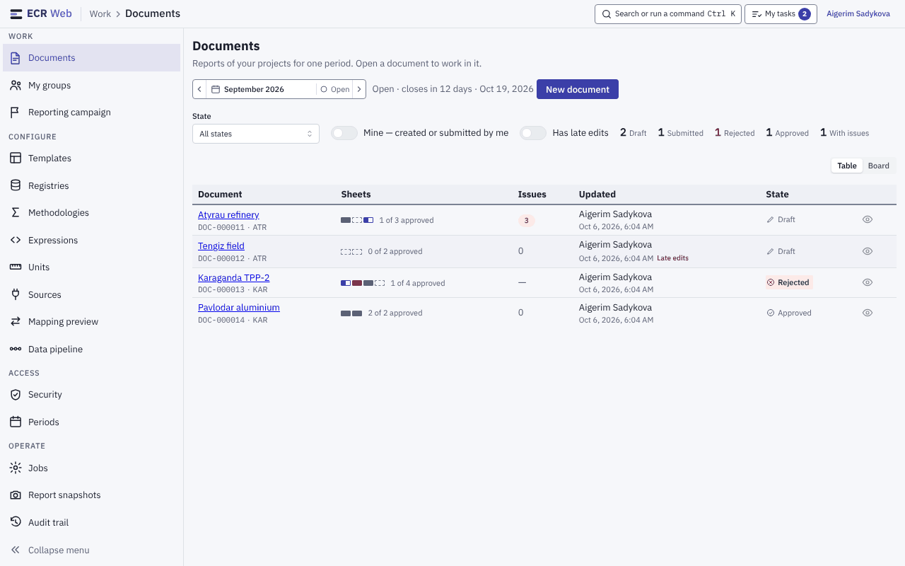
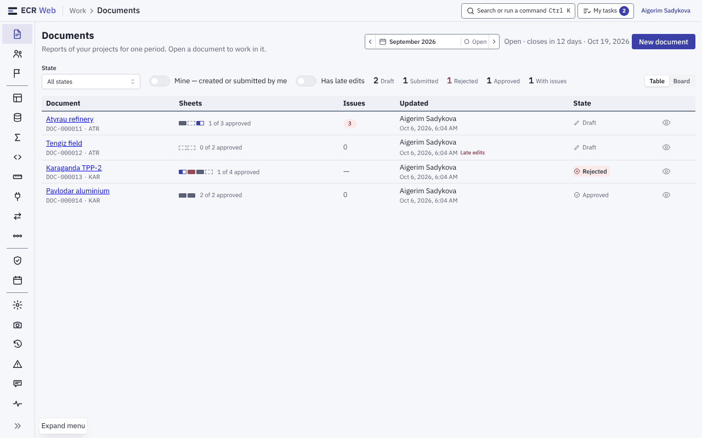
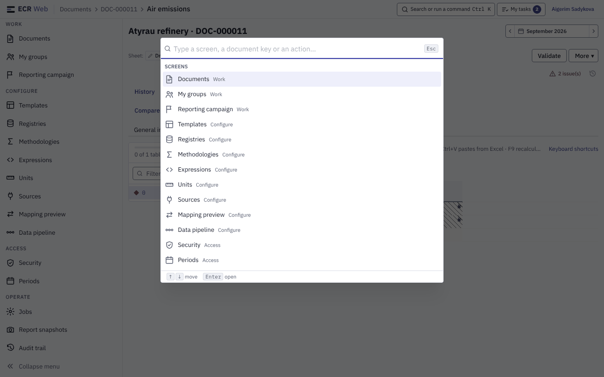
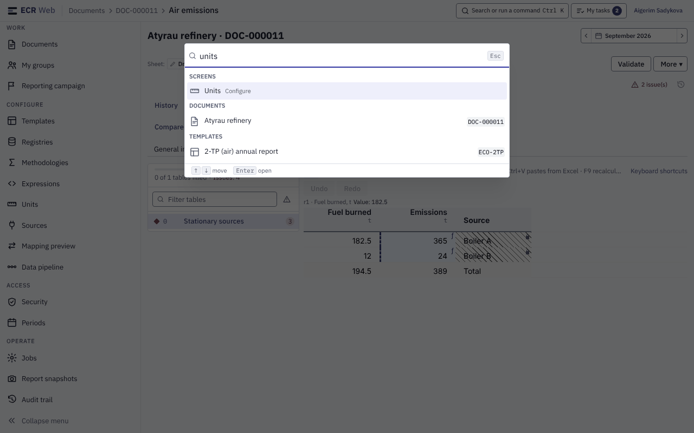
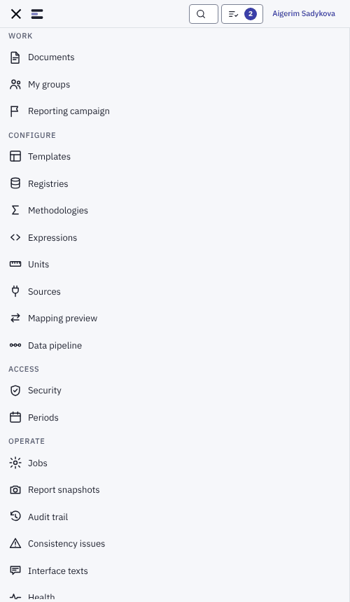

# 1. Меню, крихти, палітра команд, вузький екран

Знімки — приклад із тестовими даними й усіма правами (див. [README](README.md)).

## 1.1. Меню з групами

Ліве меню поділене на чотири групи. Пункт видно, лише якщо у вас є право,
зазначене в останній колонці; група, в якій вам не дістався жоден пункт,
зникає цілком.

| Група | Пункт | Потрібне право |
|---|---|---|
| **Work** | Documents | — (усім) |
| | My groups | — (усім) |
| | Reporting campaign | `Report.ViewCampaign` |
| **Configure** | Templates | `Template.View` |
| | Registries | `Registry.View` |
| | Methodologies | `Calculation.View` |
| | Expressions | `Calculation.View` разом із `Template.View` |
| | Units | `Calculation.View` |
| | Sources | `Integration.View` або `Integration.Manage` |
| | Mapping preview | `Integration.Manage` |
| | Data pipeline | `Integration.Manage` |
| **Access** | Security | `Security.ManageRoles` |
| | Periods | `Period.Configure` |
| **Operate** | Jobs | `System.ViewHealth` |
| | Report snapshots | `Report.ViewRegulatory` |
| | Audit trail | `Security.ViewAudit` |
| | Consistency issues | `System.ViewHealth` |
| | Interface texts | `System.ManageLocalization` |
| | Health | `System.ViewHealth` |
| | Notifications | `System.ManageNotifications` |

Права роздає адміністратор (`docs/admin/admin-guide.md`, розділ 1). Не бачите
потрібного пункту — відкрийте **My groups**: там видно, які ролі у вас чинні.

Поки обліковий запис вимагає зміни пароля, меню порожнє — спершу змініть
пароль (`../user-guide.md`, розділ 1.4).

## 1.2. Згорнуте меню

1. Унизу меню натисніть **Collapse menu** — лишаються тільки іконки, а
   таблиці отримують більше місця.
2. Назад — **Expand menu** на тому самому місці. Назву пункту в згорнутому
   меню видно в підказці при наведенні миші або фокусі з клавіатури.
3. Вибір запам'ятовується за вашим обліковим записом і діє на інших
   комп'ютерах. На вузькому екрані (розділ 1.5) згортання немає: там меню
   відкривається кнопкою **Menu**.

## 1.3. Крихти у верхній смузі

У верхній смузі після «ECR Web» показано, де ви: **група › екран**
(наприклад, «Configure › Registries») або шлях до вкладеного екрана
(«Documents › DOC-000011 › Air emissions» — документ і відкритий аркуш).
Назва групи — просто підпис; проміжні ланки шляху (наприклад, «Documents»,
«DOC-000011») — посилання на рівень вище; остання ланка — поточний екран.
Якщо шлях довгий,
середина ховається за кнопкою **Show the whole path**.

## 1.4. Палітра команд (Ctrl+K)

1. Натисніть **Ctrl+K** (на Mac — **⌘K**) або кнопку **Search or run a
   command** угорі. Клавіша працює й на кириличній розкладці, але не
   спрацьовує, коли курсор у полі вводу, у сітці таблиці чи в редакторі
   виразів.
2. Без запиту палітра показує:
   - **Screens** — ті самі екрани, що й у меню, з назвою групи (палітра
     пропонує рівно те, що вам дозволено в меню);
   - **Actions** — перемкнути світлу/темну тему, щільність рядків таблиць
     (компактні/комфортні), згорнути або розгорнути меню.
3. Почніть друкувати — список звузиться до екранів і знайдених даних
   (документи, шаблони, довідники; кожен тип — лише за наявності права
   перегляду). Дані шукаються від **2 символів**.

   

4. **↑ ↓** — вибір пункту, **Enter** — відкрити, **Esc** — закрити.

## 1.5. Вузький екран (телефон)

На екрані до 640 px:

- меню сховане; його відкриває кнопка **Menu** (☰) зліва вгорі, закриває —
  та сама кнопка (✕);
- підпис «ECR Web» і текст кнопки пошуку ховаються, лишаються іконки;
- сторінка не прокручується вбік;
- **документ відкривається лише для читання** — див. `03-document.md`,
  розділ 3.7.
