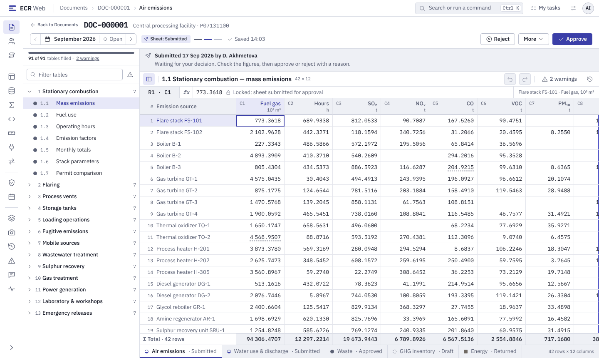
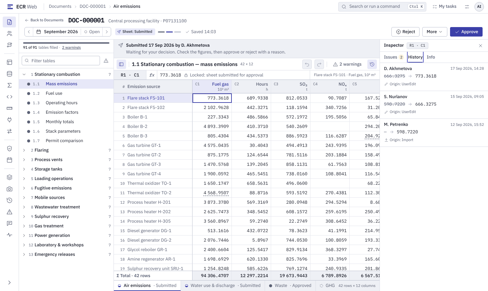
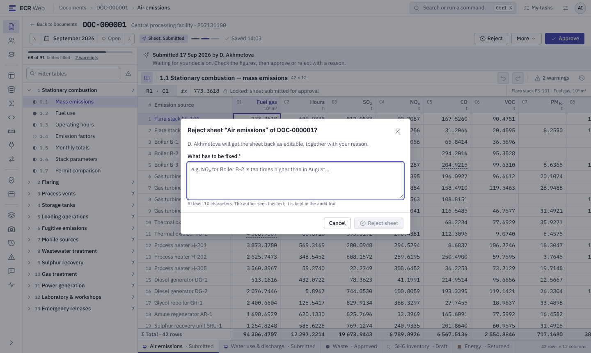
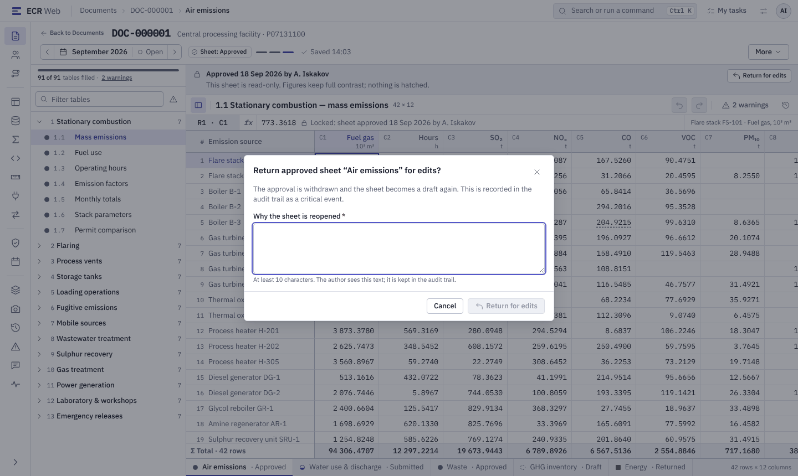

# Погоджувач (`Approver`): від входу до затвердження і звіту

Для того, хто перевіряє подані аркуші, затверджує або повертає їх і будує
звітні зрізи. Потрібні роль `Approver` і доступ до проєкту рівня `Approve`
(⚠ залежить від налаштувань). Подробиці — [`../role-guide.md`](../role-guide.md),
розділи 2 і 4.

**Що вміє роль `Approver`** (сід, `docs/admin/admin-guide.md` §1.1):
переглядати й експортувати документи, повертати на доопрацювання
(`Document.Reopen`); довідники й методики на перегляд; звітні зрізи —
перелік, вміст, побудова, вивантаження. Створювати документи й вводити дані
вона **не** може.

## 1. Увійти

Так само, як виконавець: [`01-dataentry.md`](01-dataentry.md), крок 1.

## 2. Знайти подане

1. **«Documents»** → перевірте **«Period»**.
2. Фільтр **«State»** = подано. Колонка стану показує стан кожного аркуша
   окремо: аркуші одного документа погоджуються незалежно.
3. Відкрийте документ.

## 3. Переглянути аркуш

*Макет: `#/documents/DOC-000001?as=Approver&sheetState=Submitted`. У
застосунку аркуші — вкладками над таблицею; кнопки **«Approve»**,
**«Reject»**, **«Return for edits»** стоять на панелі дій аркуша. Дерево
таблиць зліва — **(у плані)**.*

Поданий аркуш закритий для правок для всіх, зокрема для вас. Що перевірити:

- **«Validate»** → панель **«Validation findings»**: чи немає помилок і які
  попередження автор підтвердив.
- **«History»** — хто, коли й з якою причиною подавав, відхиляв, повертав.
  За багатоетапного маршруту видно крок.
- **«Compare versions»** — що змінилося між двома поданнями одного періоду:
  **«From version»**, **«To version»**, **«Compare»**.

*Макет: панель **History** у бічному «Inspector». У застосунку історія
документа — окрема панель **«History»**; бічний «Inspector» з історією
комірки — **(у плані)**.*

## 4. Затвердити

1. **«Approve»** → діалог **«Approve this sheet?»**: затверджені цифри стають
   остаточними для періоду й ідуть у регуляторні звіти.
2. Підтвердіть. Результат — «The sheet has been approved.»

⚠ Затвердити **власне** подання не можна (правило «чотирьох очей»): «Sheet …
cannot be approved by the same person who submitted it.»

⚠ залежить від налаштувань: якщо для проєкту задано маршрут погодження з
кількох кроків, аркуш проходить кроки по черзі, і затвердити може лише роль
поточного кроку.

## 5. Відхилити

*Макет: `?as=Approver&dialog=reject-reason`. У застосунку діалог
**«Reject the sheet»** з обов'язковим полем **«Reason»**.*

1. **«Reject»**.
2. У **«Reason»** напишіть, що саме виправити: автор побачить лише цей текст.
3. Результат — «The sheet has been returned to the author.», стан
   **Rejected**. Автор виправляє й подає знову.

## 6. Повернути затверджений на доопрацювання

*Макет: `?as=Approver&sheetState=Approved&dialog=return-reason`.*

1. **«Return for edits»** — для поданого або вже затвердженого аркуша.
2. Причина обов'язкова й лишається в журналі аудиту назавжди.
3. Результат — «The sheet is editable again.», аркуш знову чернетка.

Закритий період спершу має відкрити адміністратор періодів (право
`Period.Reopen`).

## 7. Звіт: регуляторний зріз

Регуляторний звіт будується не з живих даних, а зі **зрізу** — незмінної
копії на момент побудови. Екран — **«Report snapshots»** у меню.

1. Оберіть проєкт. У таблиці — **«Built at»**, **«Period»**, **«Rows»**,
   **«Status»**, **«Content hash»**; найновіший позначено «current».
2. **«Build snapshot»** → **«Report code»** і параметри звіту. Побудова йде
   фоновою задачею: «Build queued as job …» → «Snapshot built.» Повторна
   побудова створює новий зріз, старий не змінюється.
3. **«View rows»** — вміст зрізу; **«Download .xlsx»** — книга Excel (числа в
   ній округлено до 15 значущих цифр, для звірки до останнього знака —
   **«View rows»**).
4. **«Verify»** перевіряє контрольну суму зрізу.
5. Позначка **«Outdated»** — дані перераховано після побудови; щоб побачити
   актуальні цифри, побудуйте новий зріз.

Регулятор бачить лише зрізи з поданих і затверджених аркушів.

## Якщо щось пішло не так

| Бачите | Що робити |
|---|---|
| «… cannot be approved by the same person who submitted it.» | затверджує інший погоджувач |
| «A comment is required to reject the sheet.» / «A reason is required…» | заповніть **«Reason»** |
| Немає кнопки **«Approve»** | аркуш не в стані Submitted, або у вас немає рівня `Approve` на проєкт — **«My groups»**, далі до адміністратора |
| Порожній **«Report snapshots»** | немає доступу `Read` до проєкту зрізу або зрізів ще не будували |

Повна таблиця — `role-guide.md`, розділ 6.2.
