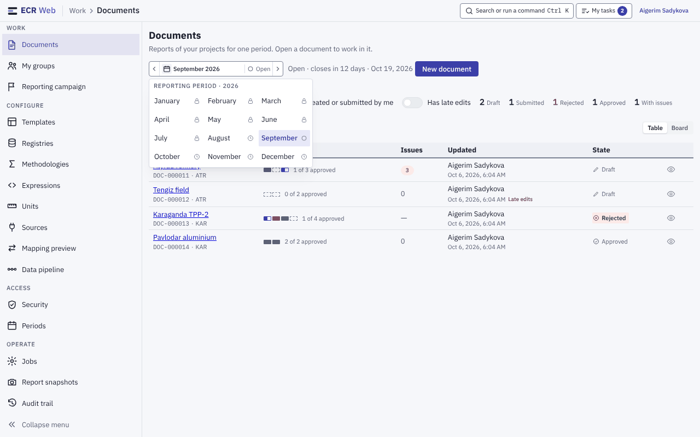
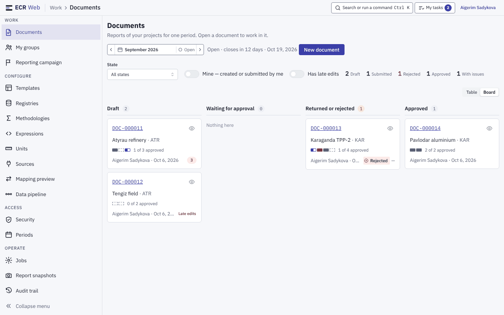
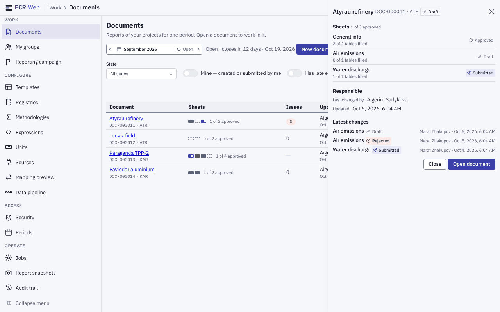
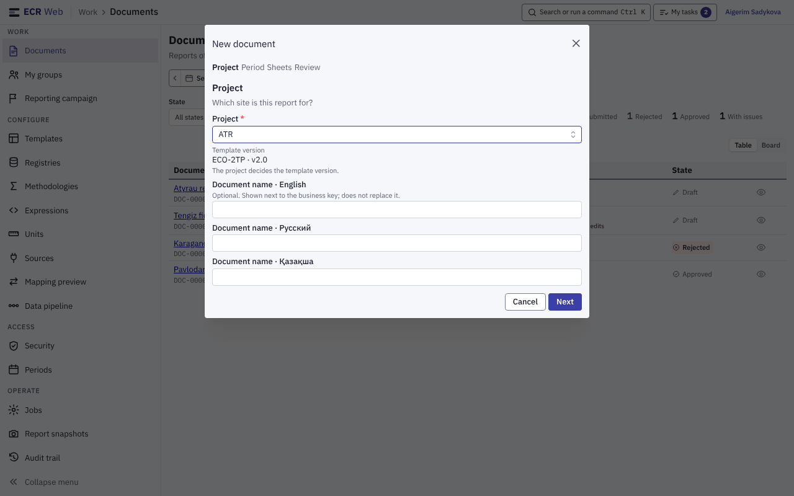
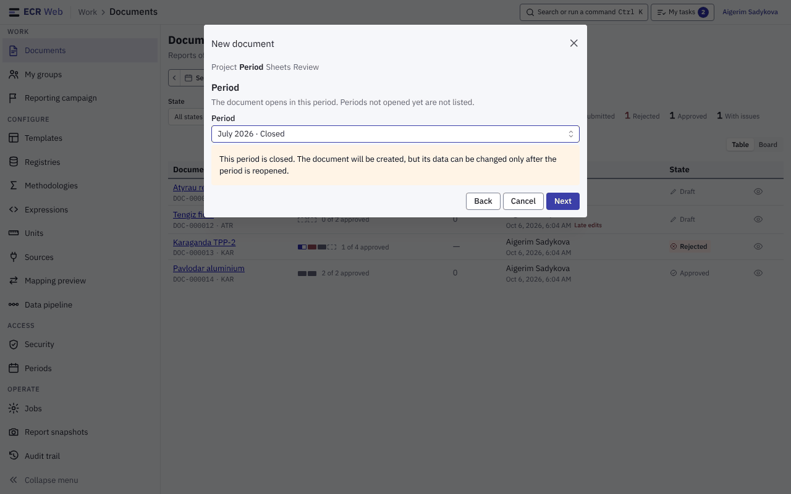
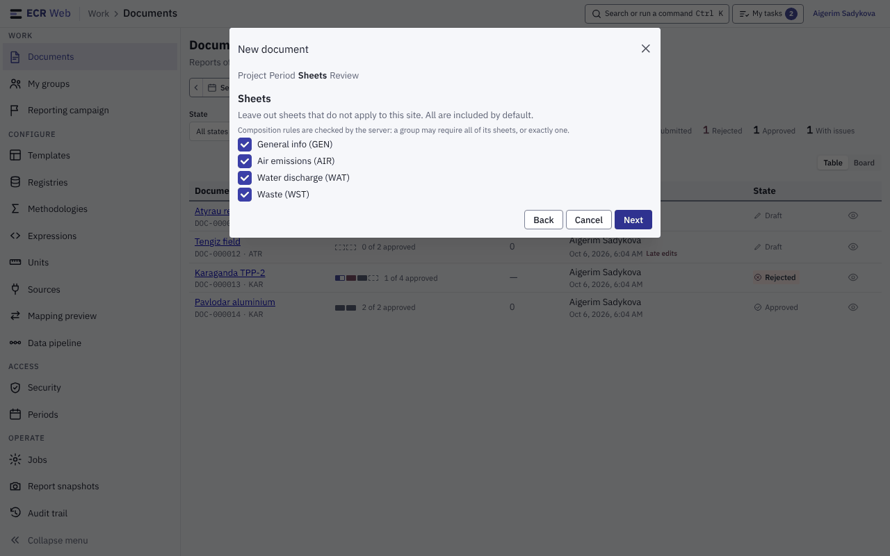
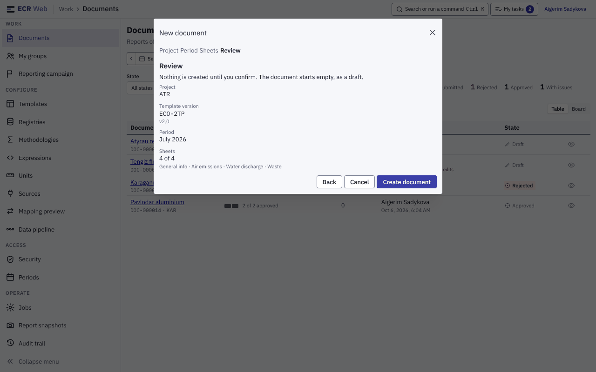

# 2. Перелік документів, період, дошка, майстер «New document»

Знімки — приклад із тестовими даними й усіма правами (див. [README](README.md)).
Екран — пункт **Documents** у групі **Work**, адреса `/`.

## 2.1. Вибір періоду

Перелік показує документи одного звітного періоду.

1. Поле періоду — угорі зліва: **‹** попередній період, назва періоду
   (наприклад, «September 2026») зі станом, **›** наступний.
2. Клік по назві (або **↓** у полі) відкриває сітку періодів року. Біля
   кожного місяця — значок стану; підказка при наведенні називає стан:
   **Open**, **Grace period**, **Not open yet**, **Closed**.
3. Можна й набрати період цифрами `РРРРММ` (наприклад, `202609`): перша
   цифра замінює назву в полі.
4. Праворуч від поля — коли період закривається: «Open · closes in 12 days ·
   Oct 19, 2026». Якщо в різних ваших проєктах стан того самого місяця
   різний, показано найвідкритіший і в скількох проєктах він такий.

Той самий вибір періоду стоїть на сторінці документа (`03-document.md`).

## 2.2. Фільтри й лічильники

У ряду під заголовком:

- **State** — All states / Draft / Submitted / Approved / Rejected;
- **Mine — created or submitted by me** — документи, де ви автор або
  подавали хоч один аркуш;
- **Has late edits** — документи, які редагували після дедлайну подання;
- лічильники «2 Draft · 1 Submitted · 1 Rejected · 1 Approved · 1 With
  issues». Клік по лічильнику стану ставить той самий фільтр **State**,
  повторний клік — знімає. «With issues» — лише число, не фільтр. Без
  обраного періоду лічильників немає.

## 2.3. Таблиця (Table)

Колонки: **Document** (назва, ключ і проєкт), **Sheets** (смужка аркушів і
«1 of 3 approved»), **Issues** (кількість зауважень перевірки, «—» якщо
документ ще не перевіряли), **Updated** (хто й коли; позначка «Late edits»),
**State**, і кнопка-око **Quick look** у кінці рядка.

## 2.4. Дошка (Board)

1. Праворуч над переліком перемкніть **Table → Board**.
2. Документи розкладено по стовпцях **Draft · Waiting for approval ·
   Returned or rejected · Approved** за найгіршим станом аркушів, які ви
   бачите (наприклад, документ із хоч одним відхиленим аркушем — у «Returned
   or rejected»). Порожній стовпець показує «Nothing here».
3. Документи без стану в цьому періоді потрапляють у п'ятий стовпець «No
   state for this period» — він з'являється, лише коли в ньому щось є.
4. Вибране подання стоїть в адресі сторінки (`?view=board`), тож посилання
   відкриє колегу саме дошку.

## 2.5. Швидкий перегляд (Quick look)

Кнопка-око в рядку відкриває шторку без переходу в документ: стан кожного
аркуша і скільки таблиць заповнено, хто востаннє змінював, останні зміни
стану. Кнопки внизу — **Close** і **Open document**. **Esc** закриває шторку й
повертає фокус на кнопку рядка. Без обраного періоду шторка просить спершу
обрати період.

## 2.6. Створення документа — майстер «New document»

Кнопку **New document** бачить лише власник права `Document.Create`. Майстер
має чотири кроки: **Project · Period · Sheets · Review**; **Back** повертає на
крок назад, **Cancel** або **Esc** закривають майстер, нічого не створюючи.

**Крок 1. Project.**

1. Оберіть **Project**. Версію шаблону (**Template version**) підставляє сам
   проєкт — вибирати її не треба.
2. **Document name** англійською, російською й казахською — необов'язкова;
   показується поруч із бізнес-ключем і не замінює його.
3. **Next**.

**Крок 2. Period.**

1. Оберіть період. Періоди, які ще не відкрито, у списку відсутні; біля
   закритих і пільгових стоїть «· Closed» / «· Grace period».
2. Закритий період обрати можна, але з'явиться попередження: «This period is
   closed. The document will be created, but its data can be changed only
   after the period is reopened.»
3. Якщо в проєкті немає жодного відкритого періоду, крок попередить, що
   дані можна буде вносити лише після відкриття періоду адміністратором.

**Крок 3. Sheets.**

1. За замовчуванням увімкнено всі аркуші; зніміть ті, що не стосуються
   об'єкта.
2. Правила складу (група може вимагати всіх своїх аркушів або рівно одного)
   перевіряє сервер під час створення; без жодного аркуша далі не пустить.

**Крок 4. Review.**

Перевірте підсумок (проєкт, версія шаблону, період, аркуші, назва) і
натисніть **Create document**. До цього моменту нічого не створюється;
документ з'являється порожньою чернеткою.
