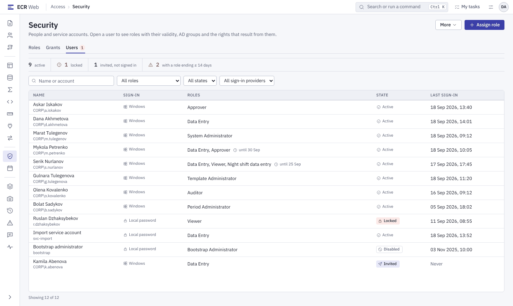

# Адміністратор: від першого входу до готового робочого місця

Для того, хто заводить людей, видає ролі й доступ, веде проєкти, періоди й
шаблони. Встановлення сервера тут не описано — воно в
[`../../delivery/QUICKSTART-FIRST-TEST.md`](../../delivery/QUICKSTART-FIRST-TEST.md)
і `docs/build/11-install-guide.md`. Повний каталог прав і обмежень —
[`../../admin/admin-guide.md`](../../admin/admin-guide.md).

## 0. Адміністративні ролі

| Роль | Що веде (після встановлення) |
|---|---|
| `BootstrapAdministrator` | лише користувачі й ролі (`Security.ManageUsers`, `Security.ManageRoles`); це роль першого запису `bootstrap` |
| `SystemAdministrator` | усі **не**небезпечні права: шаблони, довідники, методики, періоди, документи, звіти, журнал, стан системи |
| `TemplateAdministrator` | шаблони (`Template.*`), перегляд довідників і методик |
| `PeriodAdministrator` | проєкти й календарі періодів (`Period.*` без `Period.Reopen`, `Project.Manage`) |

⚠ **Небезпечні права** (керування користувачами й ролями, повторне відкриття
закритого періоду, публікація методики, джерела даних, сповіщення, ручний
запуск системних задач) не входять до `SystemAdministrator`. Їх дає лише
**нова роль**, створена з ними (крок 3). Вбудовані ролі не редагуються.

## 1. Перший вхід (`bootstrap`)

1. Відкрийте ECR з іншої машини, ніж сервер.
2. Вхід локальним записом `bootstrap` з паролем, заданим при розгортанні
   (`deploy-ecr.ps1 -BootstrapPassword`). Пароль у цьому документі не
   наводиться і в репозиторії не зберігається.
3. Система одразу вимагає новий пароль (**«Change password»**): щонайменше 12
   символів, без імені входу, не з переліку поширених. Вимоги до великих
   літер, цифр і символів код **не** застосовує, хоч макет їх малює.

⚠ `bootstrap` вимикається сам, щойно **доменному** користувачу **особисто**
призначено роль із `Security.ManageUsers`. Заведіть свого адміністратора
**до** цього. Втрачений пароль `bootstrap` на наявній базі не відновлюється
(`admin-guide.md` §2.2).

## 2. Завести людей

*Макет: `#/admin/security?tab=users`. У застосунку вкладка **«Users»**,
кнопка **«New user»** угорі, у рядку користувача — **«Access»** (ролі),
**«Reset password»**, **«Lock»** / **«Unlock»**. Смуга лічильників, фільтри й
кнопка «Assign role» — **(у плані)**.*

**«Security»** у меню → вкладка **«Users»** → **«New user»**:

- **доменний** запис — ім'я входу, ім'я людини, **«Domain SID»**; пароля в
  ECR немає, вхід через **«Sign in with Windows»**. Доменний користувач може
  також з'явитися сам після першого входу (без ролей);
- **локальний** запис — ім'я входу, ім'я, **«One-time password»**. Пароль
  вводите ви й передаєте людині особисто: сервер паролів не генерує й не
  повертає, людина змінить його при першому вході.

Обмеження: не можна заблокувати себе чи скинути собі пароль; не можна
заблокувати останнього адміністратора або зняти з нього право керування
користувачами. Блокування — з обов'язковою причиною, знімається лише
**«Unlock»**.

Технічний запис `svc-integration` (збір даних з AF) не видаляйте й не вмикайте
для входу.

## 3. Ролі

Вкладка **«Roles»**:

- вбудовані ролі (`DataEntry`, `Approver`, `Viewer`, `ReportViewer`,
  `Auditor` і адміністративні) — лише на перегляд;
- **«New role»** — роль із власним набором прав; **«Clone»** — копія наявної
  як основа для нової. Небезпечні права позначено; їх видача пишеться в
  журнал безпеки;
- набір прав наявної ролі не змінюється: потрібен інший набір — нова роль.

## 4. Призначити ролі людині

У рядку користувача — **«Access»**:

1. Відмітьте ролі. Список замінюється **цілком**: ці ролі й будуть ролями
   людини.
2. За потреби звузьте роль: **«Projects»**, **«Sheets»**, **«Periods from»** /
   **«to»**. Роль, звужена проєктами, не дає загальносистемних прав
   (`Security.*`, `Template.*`, `Registry.*`).
3. **«Save»** — «Saved: {count} role(s) assigned.»

Ролі можна видати й доменній групі AD (`admin-guide.md` §2.5). ⚠ Які групи
відповідають яким ролям, вирішує замовник — дефолту немає.

## 5. Дати доступ до проєктів (гранти)

Роль каже, **що** людина може робити; грант каже, **де**. Без гранта роль
не відкриває жодного проєкту.

Вкладка **«Grants»**:

1. **«Pick a role»** — оберіть роль. Гранти в застосунку видаються **ролі**,
   а не окремій людині (у макеті — людині, рішення D15-15).
2. **«Add grant»** → **«Resource»** (проєкт, аркуш, таблиця, колонка,
   довідник) → **«Level»**: `Read`, `Write`, `Submit`, `Approve`, `Manage`
   або **«Deny»** (заборона перемагає дозволи).
3. **«Save»** — «Access updated; affected sessions revalidate immediately.»

Типовий мінімум для першого тестування: роль виконавця — `Write` на проєкт
(подання дає право `Document.Submit` у `DataEntry`), роль погоджувача —
`Approve` на проєкт.

Перевірити, що вийшло: **«My groups»** під обліковим записом людини, або
пояснення доступу в рядку користувача (`admin-guide.md` §2.3).

## 6. Проєкти й періоди

**«Periods»** у меню (право `Period.Configure`):

1. **«Pick a project»** або **«New project»**; **«Clone project»** копіює
   наявний.
2. Новий проєкт — чернетка: періоди закриті, доки не натиснете
   **«Activate project»**.
3. Стан періоду (**Not open yet** → **Open** → **Grace period** →
   **Closed**) система перераховує **сама** щогодини за політикою
   `ECR-Standard` (зсуви: відкриття 0, пільговий строк 15, остаточне закриття
   45 днів; `admin-guide.md` §4). ⚠ Відповідність регламенту підприємства
   вирішує замовник.
4. **«Make current»** — закріпити поточний період вручну, з причиною.
5. **«Reopen period»** — відкрити закритий період (небезпечне
   `Period.Reopen`, причина обов'язкова).
6. **«Archive»** — проєкт в архів, документи лише на перегляд.

Ручні кнопки «Open / Close / Archive period» для окремого місяця, як у
макеті, — **(у плані)**: Q15-02.

## 7. Шаблони, довідники, методики

- **«Templates»** (`Template.Edit`, `Template.Publish`): **«New template»** →
  картка шаблону → **«New version»** → таблиці, колонки, формули, правила
  перевірки → **«Publish»**. Документи створюються лише з опублікованої
  версії. Перед публікацією сервер перевіряє версію й показує проблеми.
- **«Registries»**: записи (`Registry.EditData`), структура
  (`Registry.EditDefinition`), **«Publish»** (`Registry.Publish`). Довідник,
  синхронізований із AF, вручну не редагується.
- **«Methodologies»**, **«Expressions»**, **«Units»** — методики, вирази й
  одиниці; публікація методики — небезпечне `Calculation.Publish`.

⚠ Клон версії шаблону копіює заборони й дозволи рівня ≤ `Read`; дозволи
вище (`Write` на колонку тощо) видайте на новій версії заново
(`admin-guide.md` §1.1).

## 8. Щоденний нагляд

| Екран | Для чого | Право |
|---|---|---|
| **«Jobs»** | фонові задачі: імпорт, перерахунок, експорт, побудова зрізів | `System.ViewHealth` |
| **«Health»** | стан системи й готовність служб | `System.ViewHealth` |
| **«Consistency issues»** | розбіжності даних, знайдені перевіркою | `System.ViewHealth` |
| **«Audit trail»** | хто що змінив, вхід, видача прав | `Security.ViewAudit` |
| **«Interface texts»** | тексти інтерфейсу en/ru/kz | `System.ManageLocalization` |
| **«Notifications»** | SMTP, канали, правила сповіщень | `System.ManageNotifications` (небезп.) |

Пункт меню видно, лише якщо є право. Операції сервера (служби, журнали,
оновлення) — `docs/admin/operations-runbook.md`.

## Відомі обмеження (RC4)

- `bootstrap` без ролі `TemplateAdministrator` не видає гранти на колонки
  (403). Обхід — користувач із ролями `BootstrapAdministrator` і
  `TemplateAdministrator`.
- `/me` віддає лише глобальні права: для ролі з областю проєкту кнопка
  **«Submit»** може бути сірою, хоч сервер подання дозволить.
- Політика паролів змінюється лише SQL-оновленням (`sec.PasswordPolicy`,
  DBA); екрана немає.

Повний перелік — `docs/release-notes/rc-2026-10-23.md`, «Known limitations».
