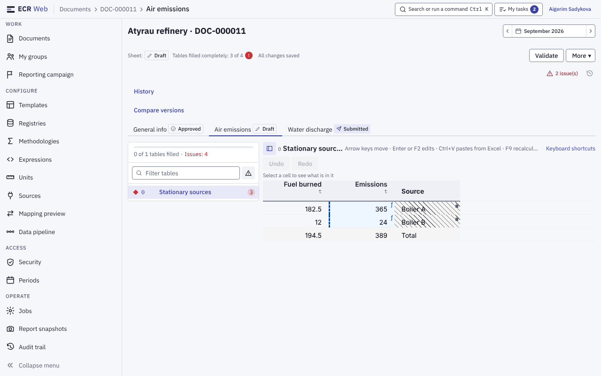
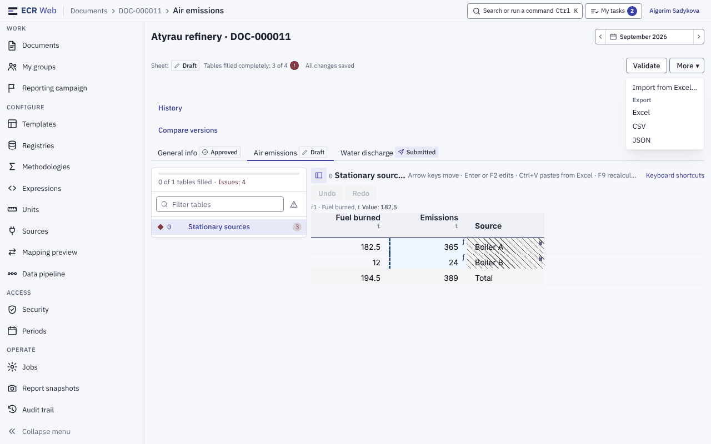
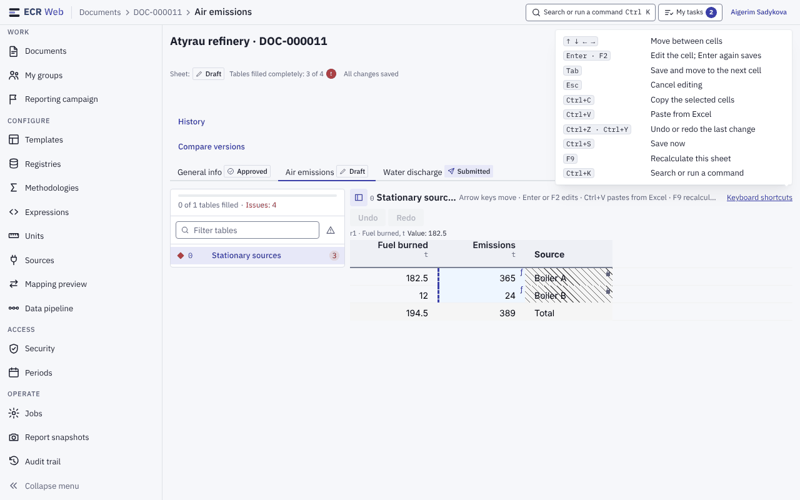
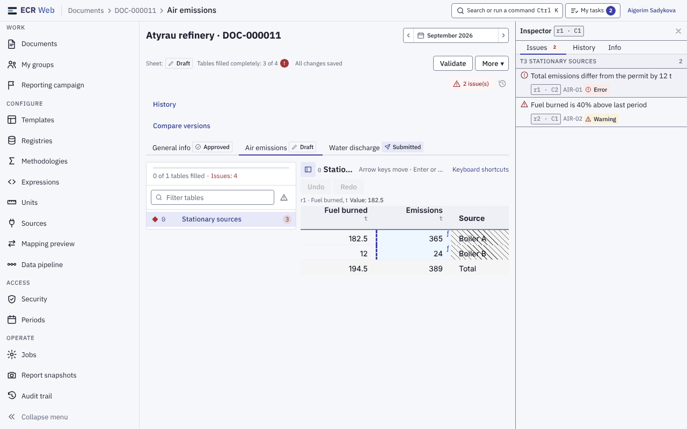
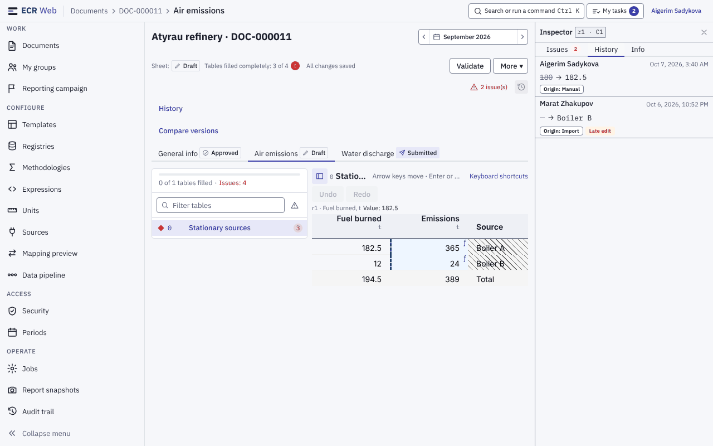
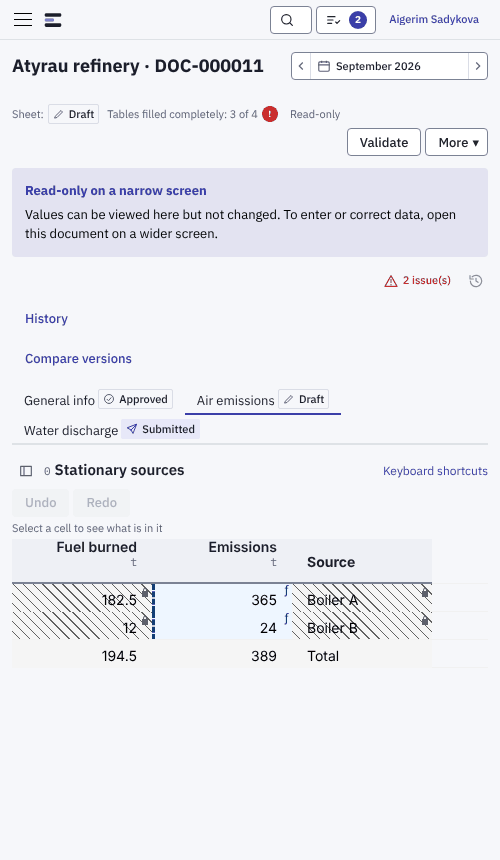

# 3. Екран документа: дерево таблиць, інспектор, клавіші

Знімки — приклад із тестовими даними й усіма правами (див. [README](README.md)).
Документ відкривається з переліку (`02-documents.md`) кліком по назві або
кнопкою **Open document** у швидкому перегляді.

## 3.1. Шапка і панель дій

Зверху вниз:

1. **Крихти** у верхній смузі: «Documents › DOC-000011 › Air emissions» —
   ключ документа й відкритий аркуш (`01-navigation.md`, розділ 1.3).
2. **Назва · ключ** документа і праворуч **вибір періоду** — той самий, що
   на переліку (`02-documents.md`, розділ 2.1): **‹ ›** перемикають сусідні
   періоди.
3. **Рядок стану**: «Sheet: Draft» (стан відкритого аркуша), «Tables filled
   completely: 3 of 4» (червоний знак — є зауваження), стан збереження («All
   changes saved») або «Read-only», якщо змінювати не можна.
4. **Кнопки дій** праворуч. Головна дія одна й залежить від стану аркуша та
   ваших прав: **Submit** на чернетці, **Approve** (поруч **Reject**) на
   поданому, **Return for edits** на погодженому. **Validate** видно поруч, а
   там, де панель зайнята рішенням погоджувача або поверненням, — у меню
   **More**.
5. Для поданого, погодженого чи відхиленого аркуша під панеллю — банер: хто,
   коли і що робити далі (наприклад, «Approved Oct 3, 2026 by … This sheet
   has been approved; editing is closed until it is returned for edits.»).

### Меню «More»

У **More ▾** зібрано рідші дії; кожну видно лише тоді, коли вона вам доступна:

- **Import from Excel…** — імпорт `.xlsx` з переглядом перед застосуванням
  (`../user-guide.md`, розділ 8.2);
- **Export**: **Excel**, **CSV**, **JSON** — вибір пункту одразу запускає
  вивантаження; поки файл будується, у рядку стану «Building...», готовий файл —
  у повідомленні та в «My tasks» (`../user-guide.md`, розділи 8.1, 9);
- **Recalculate** із позначкою **F9** — перерахувати аркуш (розділ 3.5);
- **Recall** — відкликати подання;
- рідкі дії з документом (зміна бізнес-ключа, перенесення на іншу версію
  шаблону, видалення) — за окремими правами.

## 3.2. Аркуші

Під панеллю — вкладки аркушів, у кожної бейдж стану (**Draft**,
**Submitted**, **Approved**, **Rejected**). Відкритий аркуш видно в крихтах.
Над вкладками — посилання **History** (історія узгодження) і **Compare
versions** (порівняння версій), `../user-guide.md`, розділ 7.

## 3.3. Дерево таблиць

Ліворуч від сітки — перелік таблиць аркуша:

- угорі смужка й підпис «0 of 1 tables filled», червоним — «Issues: N»;
- поле **Filter tables** — пошук таблиці за назвою;
- кнопка з трикутником — **Show only tables with errors**;
- рядок таблиці: номер, назва, червоне число — кількість зауважень у ній;
  червоний ромб — у таблиці є помилки;
- клік по рядку відкриває таблицю в сітці;
- кнопка ▯ ліворуч від назви таблиці над сіткою (**Table navigator**)
  ховає й показує дерево, коли потрібне місце для сітки.

## 3.4. Сітка

- Над сіткою — назва таблиці й **підказка клавіш**: «Arrow keys move · Enter
  or F2 edits · Ctrl+V pastes from Excel · F9 recalculates» (на аркуші лише
  для читання — «Arrow keys move · Ctrl+C copies»), поруч посилання
  **Keyboard shortcuts**.
- **Undo** / **Redo**; рядок вибраної комірки: «r1 · Fuel burned, t ·
  Value: 182.5». Поки нічого не вибрано — «Select a cell to see what is in
  it».
- Під сіткою — «Rows: 2 · columns: 3».
- Введення чисел, вставка з Excel, автозбереження, конфлікти —
  `../user-guide.md`, розділ 4.

## 3.5. Клавіші і F9

**Keyboard shortcuts** відкриває довідку:

| Клавіші | Дія |
|---|---|
| ↑ ↓ ← → | Перехід між комірками |
| Enter · F2 | Редагувати комірку; ще раз Enter — зберегти |
| Tab | Зберегти й перейти до наступної комірки |
| Esc | Скасувати редагування |
| Ctrl+C | Копіювати вибрані комірки |
| Ctrl+V | Вставити з Excel |
| Ctrl+Z · Ctrl+Y | Скасувати / повторити останню зміну |
| Ctrl+S | Зберегти зараз |
| F9 | Перерахувати цей аркуш |
| Ctrl+K | Пошук або команда (палітра, `01-navigation.md`, розділ 1.4) |

На аркуші лише для читання довідка показує тільки клавіші перегляду.

**F9** робить те саме, що **Recalculate** у **More**: спершу зберігає набране,
потім ставить перерахунок аркуша. F9 нічого не робить, коли перерахунок
недоступний: в документі є поданий або погоджений аркуш, період закритий,
екран вузький — або коли курсор у полі вводу, редакторі комірки чи
діалозі. Межа частоти перерахунку — `../user-guide.md`, розділ 5.2.

## 3.6. Інспектор: Issues, History, Info

Інспектор — колонка праворуч від сітки, за замовчуванням закрита. Відкрити:

- кнопка **N issue(s)** над вкладками аркушів — вкладка **Issues**;
- кнопка з годинником поруч (**History of the selected cell**) — вкладка
  **History**;
- після **Validate** зі знайденими зауваженнями інспектор відкривається сам.

Закрити — **✕** або **Esc**; фокус повертається на кнопку, що його
відкрила. Відкритий інспектор записано в адресу (`?panel=issues|history|info`),
тож він лишається після оновлення сторінки й передається посиланням. На
екрані до 1180 px інспектор лягає поверх сітки й закривається після переходу
до комірки.

**Issues** — зауваження останньої перевірки, згруповані за таблицями: текст,
адреса комірки («r1 · C2»), код правила і рівень (**Error** / **Warning**).
Клік по зауваженню веде в комірку (**Show in the table**). Якщо перевірки
ще не було — «Not validated yet»; якщо зауважень немає — «No issues found».

**History** — історія вибраної комірки в цьому періоді за останні 12
місяців: хто, коли, було → стало, джерело зміни («Origin: Manual / Import»),
позначка «Late edit», якщо зміну внесено після дедлайну. Для перегляду
достатньо права бачити документ (`Document.View`); без вибраної комірки —
«No cell selected», без змін — «No history».

**Info** — відомості про вибрану комірку: адреса, рядок, колонка, тип, як
вводиться («Calculated on the server», «Read-only» або «Manual · paste ·
import»), збережене значення, таблиця і скільки в ній помилок і
попереджень.

## 3.7. Вузький екран

На екрані до 640 px документ відкривається **лише для читання**: значення
видно, але змінити не можна — банер «Read-only on a narrow screen. Values can
be viewed here but not changed. To enter or correct data, open this document on
a wider screen.» Дії узгодження (подати, погодити, відхилити, повернути)
лишаються доступними. Якщо аркуш і так закритий (поданий, погоджений), окремого
банера немає — діє банер стану аркуша.
