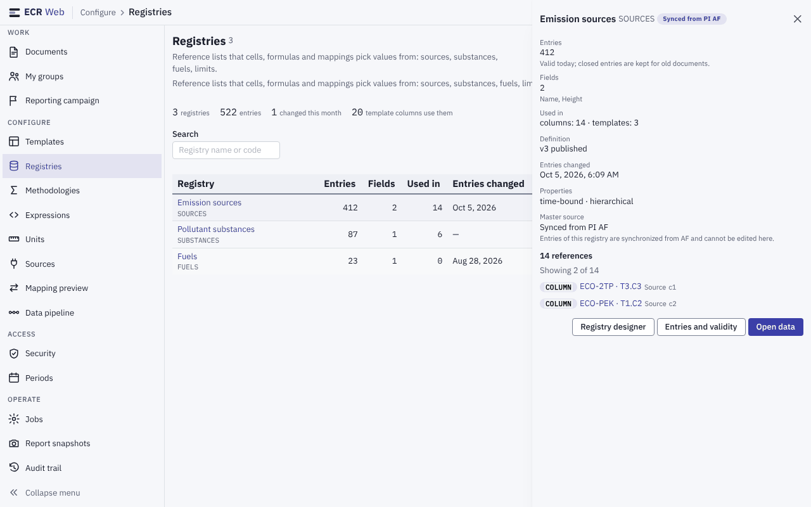
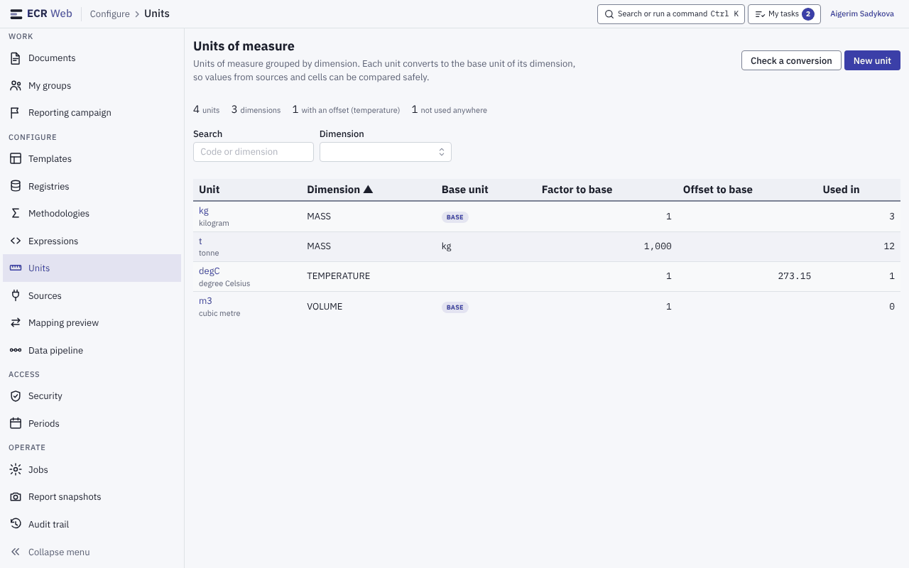
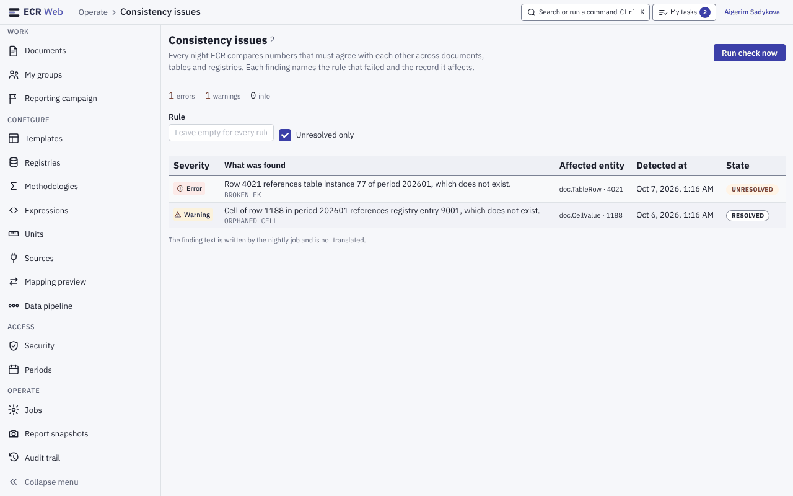
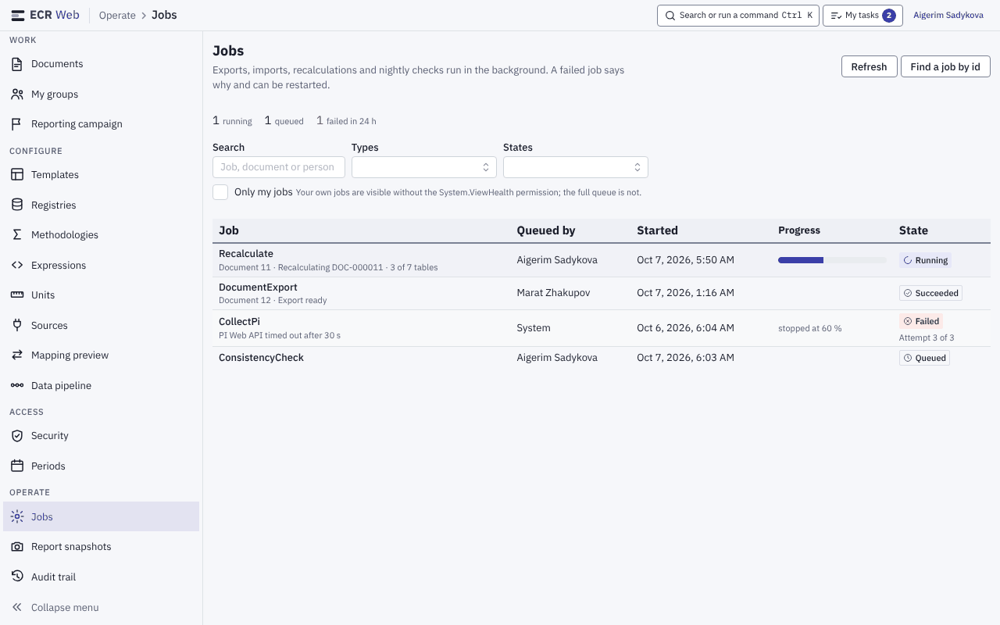
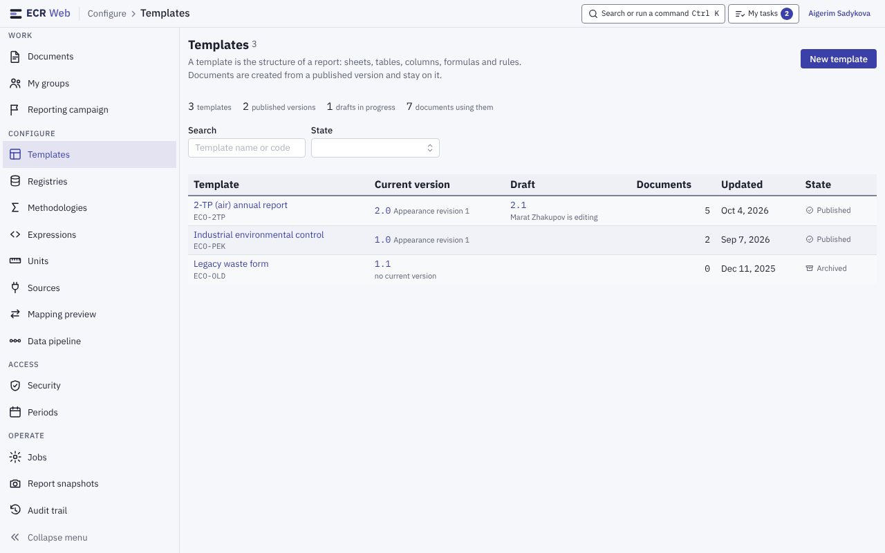
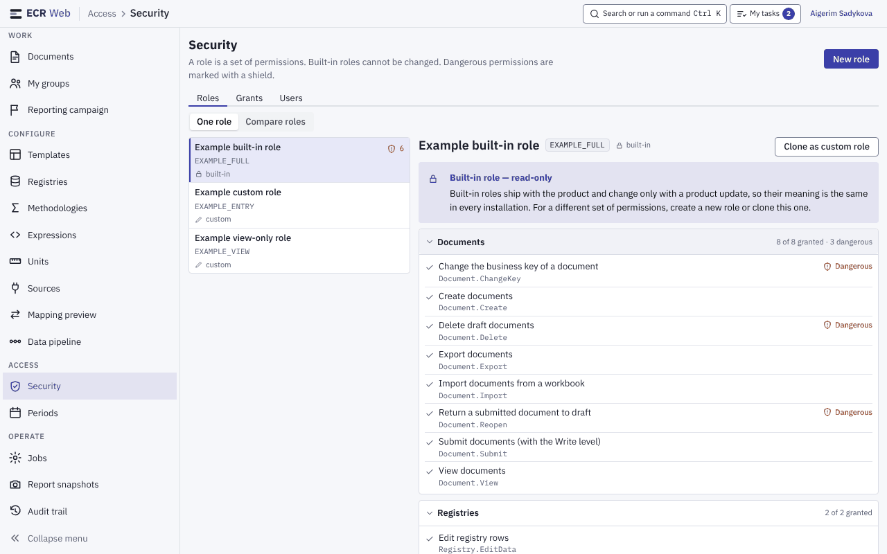
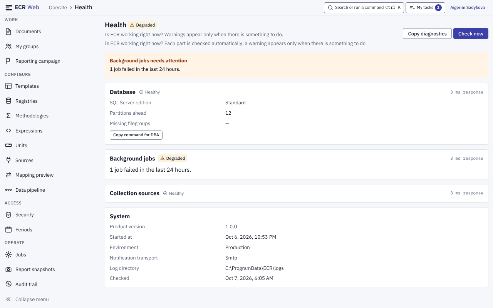

# 4. Адміністративні переліки: спільна будова і сім екранів

Знімки — приклад із тестовими даними й усіма правами (див. [README](README.md)).
Назви ролей на знімку Security — вигадані приклади, а не ролі продукту.
Як налаштовувати довідники, одиниці, шаблони, права й сповіщення —
`docs/admin/admin-guide.md`; тут — лише що є на екрані й де шукати.
Потрібні права для пунктів меню — `01-navigation.md`, розділ 1.1.

## 4.1. Спільна будова переліку

Усі переліки цієї пачки побудовано однаково:

1. Крихти «Група › Екран» у верхній смузі.
2. Заголовок і **одне** речення-пояснення, що це за екран; праворуч — головні
   кнопки.
3. Смуга показників (кілька чисел із підписами).
4. Фільтри: **Search** і списки-фільтри.
5. Таблиця. Клік по рядку (або Enter на кнопці рядка) відкриває шторку
   подробиць праворуч; **Esc** закриває шторку й повертає фокус на рядок, з
   якого її відкрили. Відкрита шторка записана в адресу сторінки
   (`?panel=…`), тож посиланням можна поділитися.

## 4.2. Registries (довідники)

- Кнопки: **Switch master source**, **New registry**.
- Показники: кількість довідників, записів, змінених цього місяця, колонок
  шаблонів, що їх використовують.
- **Search** — за назвою або кодом.
- Колонки: **Registry**, **Entries**, **Fields**, **Used in**, **Entries
  changed**, **State** (Published / Draft), **Properties** (time-bound,
  hierarchical, джерело — наприклад, «Synced from PI AF»).
- Шторка: кількість записів, поля, де використовується (колонки й шаблони,
  перелік посилань), версія визначення, коли змінювались записи, властивості,
  головне джерело. Кнопки шторки: **Registry designer**, **Entries and
  validity**, **Open data**.

## 4.3. Units (одиниці виміру)

- Кнопки: **Check a conversion** (перевірити перерахунок між одиницями),
  **New unit**.
- Показники: кількість одиниць, розмірностей, одиниць зі зсувом
  (температура), одиниць, що ніде не використовуються.
- Фільтри: **Search**, **Dimension**.
- Колонки: **Unit** (код і назва другим рядком), **Dimension**, **Base unit**
  (позначка **BASE** — сама базова одиниця), **Factor to base**, **Offset to
  base**, **Used in** (скільки колонок шаблонів і полів довідників на неї
  посилаються).

## 4.4. Consistency issues (перевірка узгодженості)

- Щоночі ECR звіряє числа, які мають збігатися між документами, таблицями й
  довідниками. Кожна знахідка називає правило і запис.
- Кнопка **Run check now** — запустити перевірку зараз.
- Показники: errors / warnings / info.
- Фільтри: **Rule**, **Unresolved only**, **Severity**.
- Колонки: рівень, **What was found**, правило, **Affected entity**,
  **Detected at**, **State** (UNRESOLVED / RESOLVED).
- Текст знахідки пише нічна задача, і він не перекладається — так і
  написано під таблицею.

## 4.5. Jobs (фонові задачі)

- Вивантаження, імпорти, перерахунки й нічні перевірки йдуть у фоні;
  провалена задача пише причину, її можна перезапустити.
- Кнопки: **Refresh**, **Find a job by id**.
- Показники: running, queued, failed in 24 h.
- Фільтри: **Search** (задача, документ або людина), **Types**, **States**,
  **Only my jobs**. Підказка поруч: свої задачі видно й без права
  `System.ViewHealth`, усю чергу — ні.
- Колонки: **Job** (тип, документ, повідомлення), **Queued by**, **Started**,
  **Progress**, **State** (для проваленої — «Attempt N of M»).
- Свої задачі звичайний користувач бачить у «My tasks» у верхній смузі
  (`../user-guide.md`, розділ 9).

## 4.6. Templates (шаблони)

- Кнопка **New template**.
- Показники: шаблонів, опублікованих версій, чернеток у роботі, документів,
  що їх використовують.
- Фільтри: **Search**, **State**.
- Колонки: **Template** (назва й код), **Current version**, **Draft** (номер
  чернетки і хто її редагує), **Documents**, **Updated**, **State**
  (Published / Archived).

## 4.7. Security (ролі, гранти, користувачі)

- Вкладки **Roles**, **Grants**, **Users**; кнопка **New role**.
- На **Roles** — режими **One role** і **Compare roles**. Ліворуч перелік
  ролей (built-in / custom, щит із числом — кількість небезпечних прав),
  праворуч права ролі за групами з підсумком «N of N granted · K dangerous».
  Небезпечні права позначені щитом **Dangerous**.
- Вбудовану роль змінити не можна (банер «Built-in role — read-only»);
  для іншого набору прав — **Clone as custom role** або нова роль.
- Що яке право відкриває і які ролі є в продукті — `docs/admin/admin-guide.md`,
  розділ 1.

## 4.8. Health (стан системи)

- Біля заголовка — загальний стан (Healthy / Degraded / …). Попередження
  з'являється, лише коли є що робити: банер «… needs attention» називає першу
  причину.
- Кнопки: **Copy diagnostics** (скопіювати зведення для підтримки),
  **Check now**.
- Секції: **Database** (редакція SQL Server, на скільки розділів наперед
  створено партиції, відсутні файлові групи; кнопка **Copy command for DBA**),
  **Background jobs**, **Collection sources** — у кожної стан і час відповіді.
- **System**: версія продукту, час старту, середовище, транспорт сповіщень,
  тека журналу.
